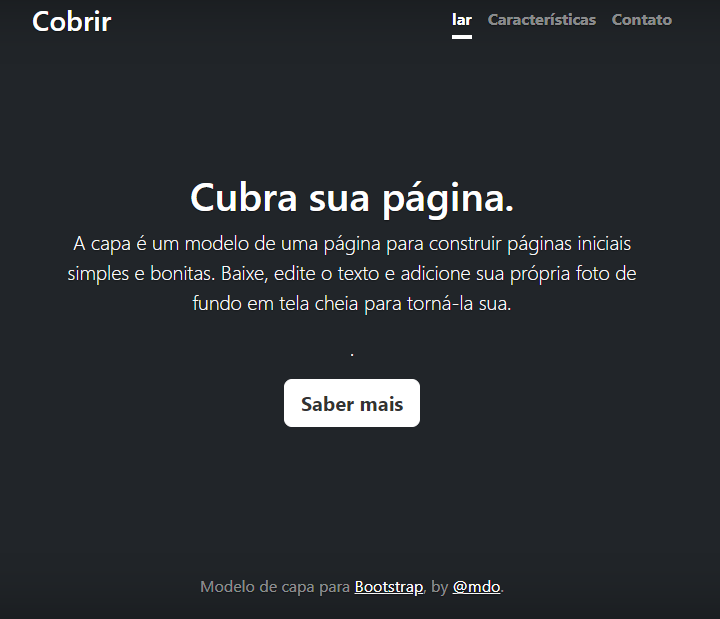

# indice
[Descrição](#descri%C3%A7%C3%A3o)
[Funcionalidades](#funcionalidades)
[Tecnologias utilizadas](#tecnologias-utilizadas)
[Fontes consultadas](#fontes-consultadas)
[Autores](#autores)
 
# 🚀 Projeto - Portfolio para escrita do README

## 📋 Descrição

## 🔧  Funcionalidades

### 🛠️  Tecnologias utilizadas

## 📦 Fontes Consultadas

## ✒️ Autore